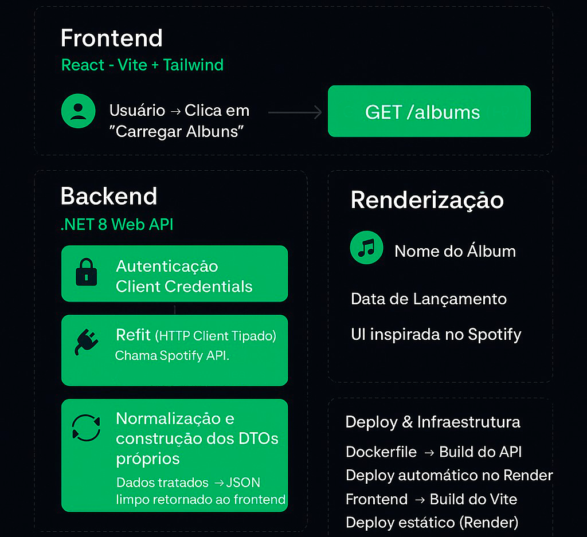

# 

# Spotify Album Request

Projeto Full‑Stack para consumo da API do Spotify, composto por **.NET 8 (Backend)** e **React + Vite (Frontend)**. O objetivo é demonstrar autenticação via Client Credentials, comunicação entre serviços, consumo de APIs externas e uma interface moderna inspirada no Spotify.

O projeto demonstra:

- 🔐 Autenticação **Client Credentials**
- 🔌 Comunicação tipada entre serviços usando **Refit**
- 🚀 Deploy com **Docker** + Render
- 🎨 Interface moderna inspirada no Spotify (React + Tailwind)
- 🧩 Organização profissional entre backend e frontend

🔗**Projeto rodando online:** [https://spotifyalbumrequestfrontend.onrender.com](https://spotifyalbumrequestfrontend.onrender.com/)

*Obs: Por ser um projeto de estudo hospedado em um servidor gratuito, após 15 minutos de inatividade a aplicação pode entrar em modo de hibernação. Nesse caso, a primeira requisição pode demorar um pouco mais para responder. Após essa requisição inicial, o desempenho volta ao normal. Agradeço a compreensão!*

---

## Tecnologias Utilizadas

### **Backend (.NET 8)**

- [ASP.NET](http://asp.net/) Core Web API
- Refit para comunicação tipada com APIs externas
- Swagger
- Autenticação Client Credentials com Spotify
- CORS configurado para ambientes real e local
- Docker
- Deploy em produção via Render

### **Frontend (React + Vite)**

- React 18
- Vite
- TailwindCSS
- Fetch API para consumo da API
- Estrutura limpa e simples
- UI inspirada no design do Spotify
- Deploy em produção via Render

## Interface do Projeto

A interface foi construída com **React + TailwindCSS**, inspirada no visual do Spotify, com botões arredondados, gradientes escuros e cartões de exibição dos álbuns.

```
[Botão] Carregar Álbuns
┌───────────────────────────────┐
│   Nome do Álbum               │
│   Lançamento: DD/MM/AAAA      │
└───────────────────────────────┘

```

---

## Fluxo de Funcionamento

```
Frontend (React)
      │
      ├──> Requisição GET /albums
      │
Backend (.NET)
   ├── Autentica no Spotify via Client Credentials
   ├── Consome "New Releases" usando Refit
   └── Retorna JSON limpo para o Frontend
      │
Frontend
   └── Exibe álbuns na UI estilizada
```

---

## 🌐 Funcionalidades Principais

- Busca de álbuns no Spotify
- Endpoints tipados com DTOs próprios
- Logs centralizados
- Swagger em produção
- Tratamento e padronização de respostas
- Código limpo e estruturado para expansão futura

---
## 🗺️ Arquitetura do Projeto



---

## 📄 Licença

Este projeto é de livre estudo e pode ser usado como base para portfólio.

---

## 🤝 Contribuições

Contribuições são bem‑vindas! Sinta‑se livre para abrir issues e pull requests.

---

## ⭐ Mostre seu apoio

Se este projeto te ajudou, deixe uma estrela no repositório!
